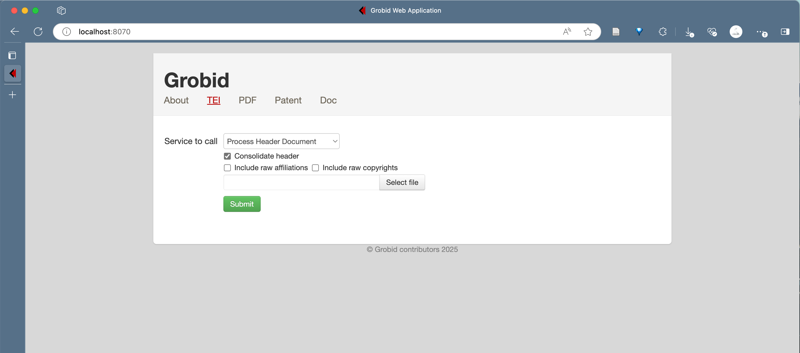
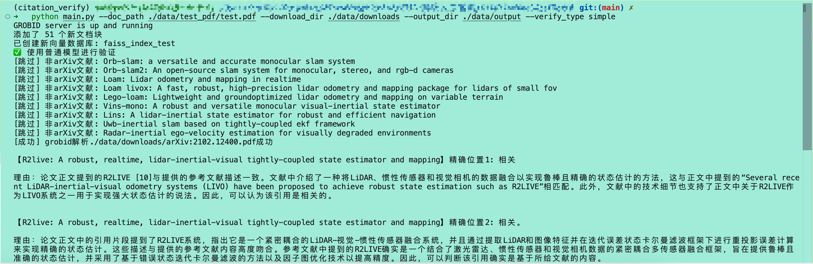
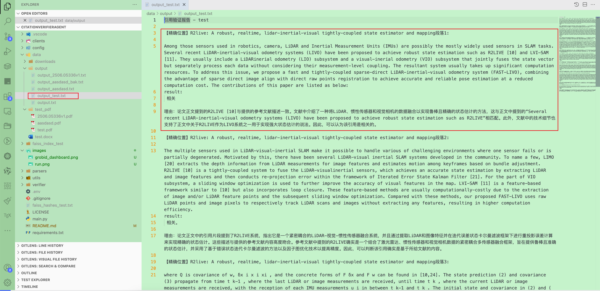

# CitationVerifierAgent

国科大杭高院高级人工智能课程大作业（论文引用查证）

项目说明：

- 功能：
  - 检查是否有错误/冗余/重复引用文献。
  - 根据文档参考文献列表，自动从 arXiv 检索并下载对应的 PDF 文献。
  - 验证论文引用是否正确。

- 特点：
  - 使用 nltk 库基于 punkt 模型进行分割论文内容，用以构建 FAISS 向量库，以方便进行 RAG 检索。
  - 本项目会针对每篇要被验证的论文构建其独立的向量库进行检索，以防止引用关系被其他论文所干扰。
  - 本项目使用 Grobid 进行论文结构解析，Grobid 相比传统根据文章结构进行正则匹配的方式，Grobid 使用机器学习的方式解析，能够更好地解析出论文的结构。
  - 本项目基于 ArxivApi 进行文献下载，验证的论文可以是任意的论文，只要是 Arxiv 上的论文都可以。
  - 在advanced模式中，本项目使用 Langchain 框架构建任务链进行验证。

## 0. Setup

> 注意：本项目使用 Grobid 进行论文结构解析，需要在本地安装 Grobid 服务，如果是 Windows 用户，则需要使用虚拟机/Docker/远程服务器进行安装。其他平台用户则可以直接使用 Docker 进行安装。

克隆项目，拉取项目代码，并创建conda环境

```bash
git clone https://github.com/SandyZ17/CitationVerifierAgent.git 
cd CitationVerifierAgent
# 创建 conda 环境
conda create -n citation_verifier python=3.10 -y
conda activate citation_verifier
# 安装依赖
pip instal -r requirements.txt
```

启动 Grobid Docker 服务

```bash
# 有显卡的情况
docker run --rm --gpus all --init --ulimit core=0 -p 8070:8070 grobid/grobid:0.8.2
# 无显卡
docker run --rm --init --ulimit core=0 -p 8070:8070 grobid/grobid:0.8.2
```

Macos

```bash
docker run --platform linux/arm64 --init -p 8070:8070 lfoppiano/grobid:latest-crf-multi-arch
```

如在本地启动 Grobid 服务后能够在 [127.0.0.1:8070](localhost:8070) 访问到如下界面。


## 1. Build && Run

在根目录下创建一个 `.env` 文件，内容如下（目前只支持使用通义千问API）：

```text
API_KEY=sk-***********
EMBEDDING_MODEL=text-embedding-v2
LLM_MODEL=qwen-max
GROBID_URL=http://127.0.0.1:8070
```

配置文件说明
API_KEY: 必填，通义千问API密钥。
EMBEDDING_MODEL: 必填，嵌入模型名称，自行选择 QWEN 官方可支持的模型。
LLM_MODEL: 必填，LLM模型名称，自行选择 QWEN 官方可支持的模型。
GROBID_URL: 必填，Grobid 服务地址，默认 `http://127.0.0.1:8070`。

运行

```bash
python main.py --doc_path your_test_pdf_path --download_dir your_arxiv_doc_dir --output_dir your_result_output_path --verify_type simple
```

参数说明

- `doc_path`: 待验证的论文路径
- `download_dir`: 下载的 Arxiv 论文的目录
- `output_dir`: 输出结果的目录
- `verify_type`: 验证类型，可选 `simple` 或 `advanced`，默认为 `simple`，simple模式使用 Grobid 进行论文引用部分解析再使用 API 进行验证，advanced模式使用 RAG 增强索引查询参考文献，使用 Langchain 框架构建任务链验证。

如下图所示运行：


运行得到结果为：


## 2. Appendix

- 项目结构

```text
CitationVerifierAgent
├── clients             # 客户端
│   └── arxiv_client.py
├── config              # 配置文件
│   └── settings.py
├── LICENSE
├── main.py             # 主程序入口
├── parsers             # 解析器
│   ├── file_parser.py
│   ├── grobid_parser.py
│   ├── latex_parser.py
│   └── word_parser.py
├── README.md
├── requirements.txt
├── utils               # 工具类
│   ├── academic_paper_splitter.py
│   └── refer_parser.py
└── verifier            # 验证器
    └── citation_verifier_system.py
```

- 项目架构图

- 项目运行流程图如下所示

